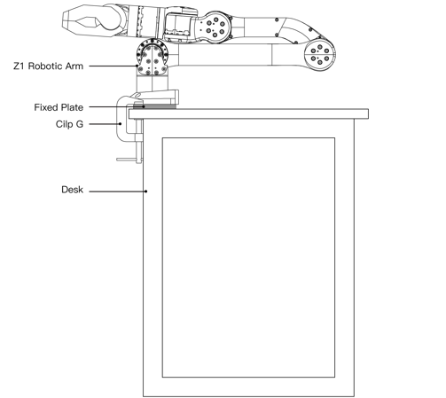

# Unitree Z1 Documentation

This documentation covers setup, operation, and technical reference for the Unitree Z1 robotic arm.

---

## Packing List

| Type | Quantity | Note |
|------|--------|------|
| Z1 | 1 | / |
| Power Adapter | 1 | DC24V |
| Fixed Plate | 1 | / |
| Clip G | 2 | / |
| Net Cable | 1 | 2m |
| Hexagon socket screws | 4 | M6X16 |
| Hexagon socket screws | 2 | M2.5X8 |
| 2mm Hexagonal wrench | 1 | / |
| 5mm Hexagonal wrench | 1 | / |

---

## Installation of Robotic Arm

The robotic arm must be mounted on a rigid platform capable of handling both static and dynamic loads.

Requirements:
- Must support full system weight
- Must resist acceleration forces during operation

Use four **M6 bolts** for mounting.

Included hardware:
- Fixing plates  
- G clips for desktop mounting

### Cable Connection
There are two main types of robotic arm cables: power supply cables and telecommunication cables.
The connector of the power supply cable of the robotic arm has a mistake-proof function, and the power supply cable can be inserted into the power supply port of the robotic arm as shown in the figure below.

Note
- The main network port is used to control the robot, and the auxiliary network port is used to change the default IP address. The two should not be mixed.
- The power supply is not hot-swappable.

